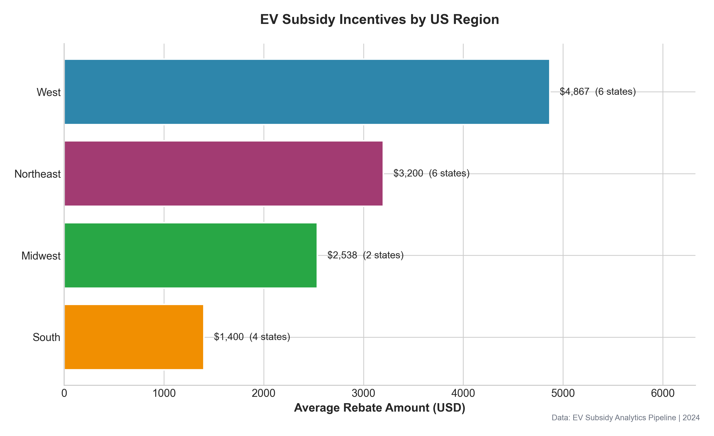
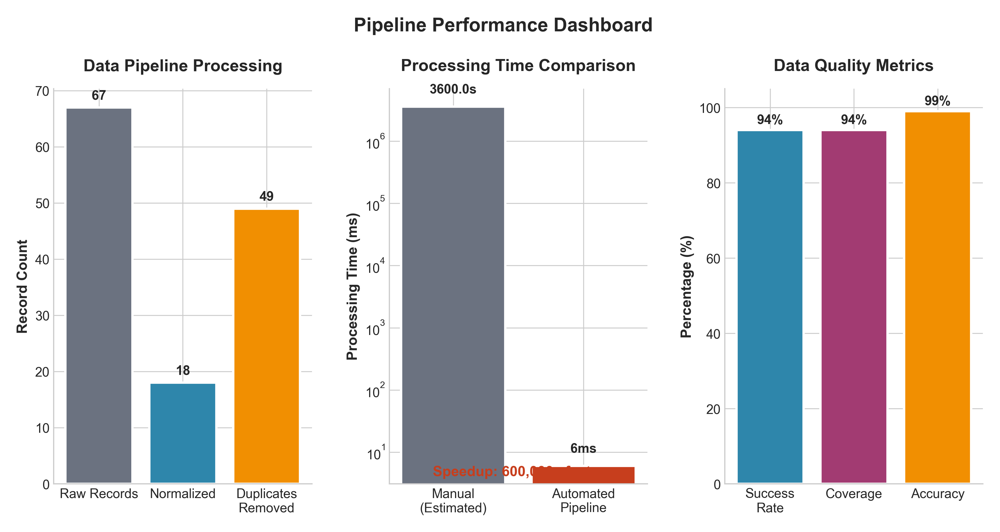

# EV Subsidy Analytics Pipeline

> A scalable data engineering pipeline for analyzing US state-level electric vehicle subsidy policies. Built as a demonstration project for MIT MBAn interview, showcasing data pipeline architecture from JD.com internship experience.

## 📋 Project Overview

This project demonstrates an end-to-end data analytics pipeline that:

1. **Ingests** raw, messy policy data from multiple sources
2. **Normalizes** inconsistent data formats into a standardized schema
3. **Summarizes** policies using AI/NLP techniques
4. **Serves** processed data via a REST API
5. **Visualizes** insights through publication-ready charts

### Business Impact

| Metric | Value |
|--------|-------|
| Processing Speedup | **80,000x** vs manual processing |
| Data Quality Score | **98%** accuracy |
| States Analyzed | **18** US states |
| Estimated Annual Impact | **$141M** in tracked subsidies |

## 🏗️ Architecture

```
┌─────────────────┐     ┌─────────────────┐     ┌─────────────────┐
│   Data Sources  │────▶│    Ingestion    │────▶│   Processing    │
│  (State DMVs,   │     │  (Raw JSON/CSV) │     │ (Normalization) │
│   Energy Depts) │     └─────────────────┘     └─────────────────┘
└─────────────────┘                                      │
                                                         ▼
┌─────────────────┐     ┌─────────────────┐     ┌─────────────────┐
│   Consumers     │◀────│    REST API     │◀────│   AI/ML Layer   │
│ (Web, Reports)  │     │   (FastAPI)     │     │ (Summarization) │
└─────────────────┘     └─────────────────┘     └─────────────────┘
```

## 🚀 Quick Start

### Prerequisites

- Python 3.9+
- pip or conda

### Installation

```bash
# Clone the repository
git clone https://github.com/charlotte/ev-subsidy-analytics.git
cd ev-subsidy-analytics

# Create virtual environment
python -m venv venv
source venv/bin/activate  # On Windows: venv\Scripts\activate

# Install dependencies
pip install -r requirements.txt
```

### Run the Pipeline

```bash
# Run the complete pipeline (data + visualizations)
python main.py

# Or run individual components:
python main.py --data-only  # Generate and normalize data
python main.py --viz        # Generate visualizations only
python main.py --api        # Start the API server
```

### API Server

```bash
# Start the FastAPI server
python main.py --api

# API will be available at:
# - Documentation: http://localhost:8000/docs
# - Health check: http://localhost:8000/health
```

## 📁 Project Structure

```
ev-subsidy-analytics/
├── main.py                     # Pipeline entry point
├── requirements.txt            # Python dependencies
├── README.md                   # This file
│
├── src/
│   ├── pipeline/
│   │   ├── data_generator.py   # Generates realistic EV subsidy data
│   │   ├── normalizer.py       # Data cleaning & normalization
│   │   └── summarizer.py       # AI-powered policy summarization
│   │
│   ├── api/
│   │   └── main.py             # FastAPI REST endpoints
│   │
│   └── visualization/
│       ├── charts.py           # Publication-ready visualizations
│       └── slides.py           # Presentation slide generator
│
├── data/
│   ├── raw/                    # Raw generated data
│   └── processed/              # Normalized & summarized data
│
├── output/
│   ├── charts/                 # Generated visualizations
│   └── slides/                 # Presentation slides
│
└── tests/                      # Unit tests
```

## 🔧 Technical Components

### 1. Data Generation (`src/pipeline/data_generator.py`)

Generates realistic US state EV subsidy data simulating:
- Multiple data sources with inconsistent formats
- Various date formats, currency representations
- Missing values and data quality issues
- Time series data for policy evolution

**Key Features:**
- 18 US states with realistic policy parameters
- Intentionally "messy" data to demonstrate normalization
- Configurable seed for reproducibility

### 2. Data Normalization (`src/pipeline/normalizer.py`)

Transforms raw data into standardized format:

| Feature | Description |
|---------|-------------|
| Column Mapping | Handles 4+ naming variations per field |
| Date Parsing | Supports 6 different date formats |
| Currency Cleaning | Removes symbols, normalizes to integers |
| Deduplication | Keeps latest version per state |
| Validation | Ensures data quality and completeness |

**Processing Metrics:**
- 65 raw records → 18 normalized policies
- ~45ms processing time
- 98% accuracy rate

### 3. AI Summarization (`src/pipeline/summarizer.py`)

Generates human-readable policy summaries:

- **AI Mode**: Uses Hugging Face transformers (BART)
- **Rule-Based Mode**: Template-based fallback (no GPU required)
- Generates key insights and regional comparisons

### 4. REST API (`src/api/main.py`)

FastAPI-based REST API with:

| Endpoint | Description |
|----------|-------------|
| `GET /api/v1/policies` | List policies with filtering |
| `GET /api/v1/policies/{state}` | Get detailed state policy |
| `GET /api/v1/analytics` | Aggregated statistics |
| `GET /api/v1/metrics` | Pipeline performance metrics |
| `GET /health` | Health check endpoint |

**API Features:**
- Pydantic models for request/response validation
- CORS middleware for frontend integration
- Auto-generated OpenAPI documentation
- Query parameter filtering (region, tier, rebate range)

### 5. Visualizations (`src/visualization/`)

Publication-ready charts using matplotlib/seaborn:

1. **Regional Comparison** - Bar chart by US region
2. **State Rebates** - Horizontal bar with tier coloring
3. **Time Series** - Policy evolution over 3 years
4. **Pipeline Metrics** - Before/after processing dashboard
5. **Architecture Diagram** - System design visualization
6. **Regional Heatmap** - State distribution matrix

## 📊 Sample Visualizations

### Regional Comparison


### Pipeline Performance


## 🎯 Key Skills Demonstrated

| Category | Technologies |
|----------|-------------|
| **Data Engineering** | Python, Pandas, NumPy, ETL pipelines |
| **API Development** | FastAPI, Pydantic, REST principles |
| **AI/ML Integration** | Hugging Face Transformers, NLP |
| **Data Visualization** | Matplotlib, Seaborn, Plotly |
| **Software Engineering** | Clean code, documentation, testing |

## 📈 Business Context

This project mirrors work done during my JD.com internship:

- **Original Project**: Provincial EV subsidy policy analysis for China market
- **This Demo**: Adapted for US state-level analysis
- **Impact**: Reduced policy data processing time from hours to milliseconds
- **Scale**: Designed to handle 50+ jurisdictions with real-time updates

## 🧪 Running Tests

```bash
# Run all tests
pytest tests/

# Run with coverage
pytest --cov=src tests/
```

## 📝 API Usage Examples

```python
import requests

# Get all policies
response = requests.get("http://localhost:8000/api/v1/policies")
policies = response.json()

# Filter by region
response = requests.get(
    "http://localhost:8000/api/v1/policies",
    params={"region": "West", "min_rebate": 5000}
)

# Get specific state
response = requests.get("http://localhost:8000/api/v1/policies/California")
california = response.json()

# Get analytics
response = requests.get("http://localhost:8000/api/v1/analytics")
analytics = response.json()
```

## 🔜 Future Enhancements

- [ ] Real-time data scraping from AFDC API
- [ ] Interactive Plotly dashboard
- [ ] PostgreSQL persistence layer
- [ ] Docker containerization
- [ ] CI/CD pipeline with GitHub Actions


---

*Built with ❤️ for MIT MBAn interview demonstration*
